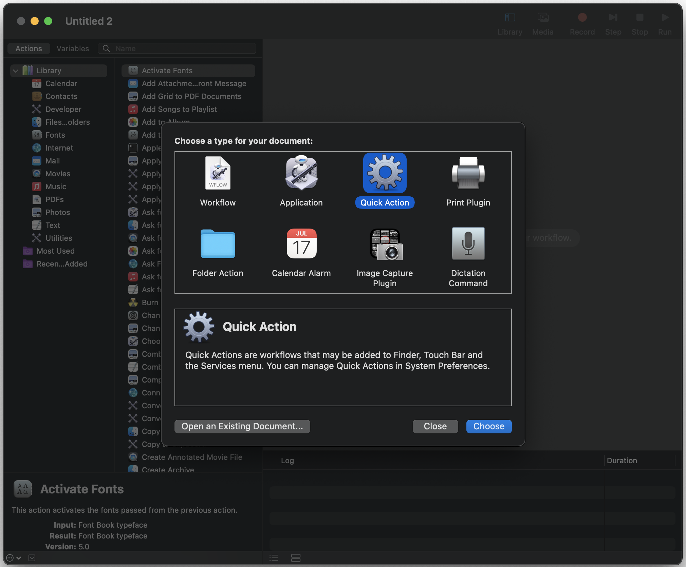
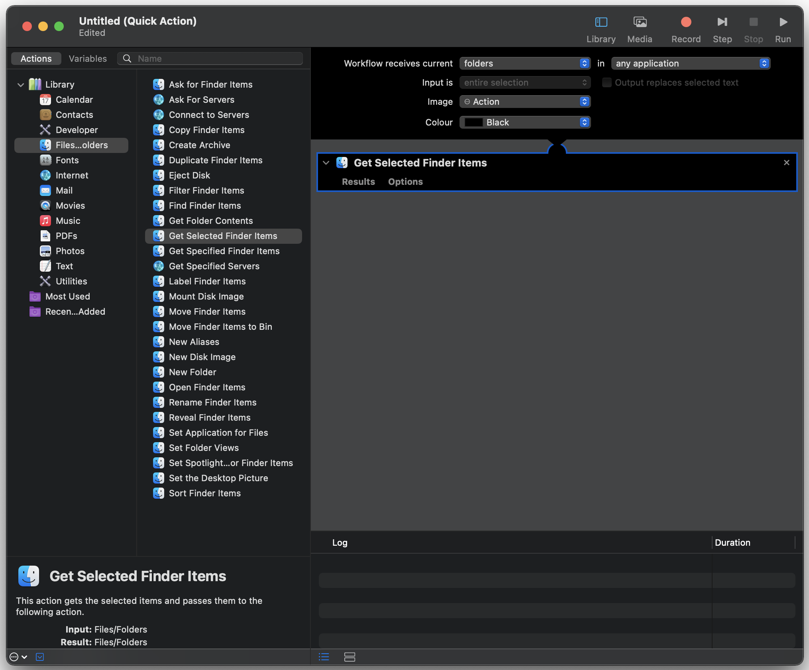
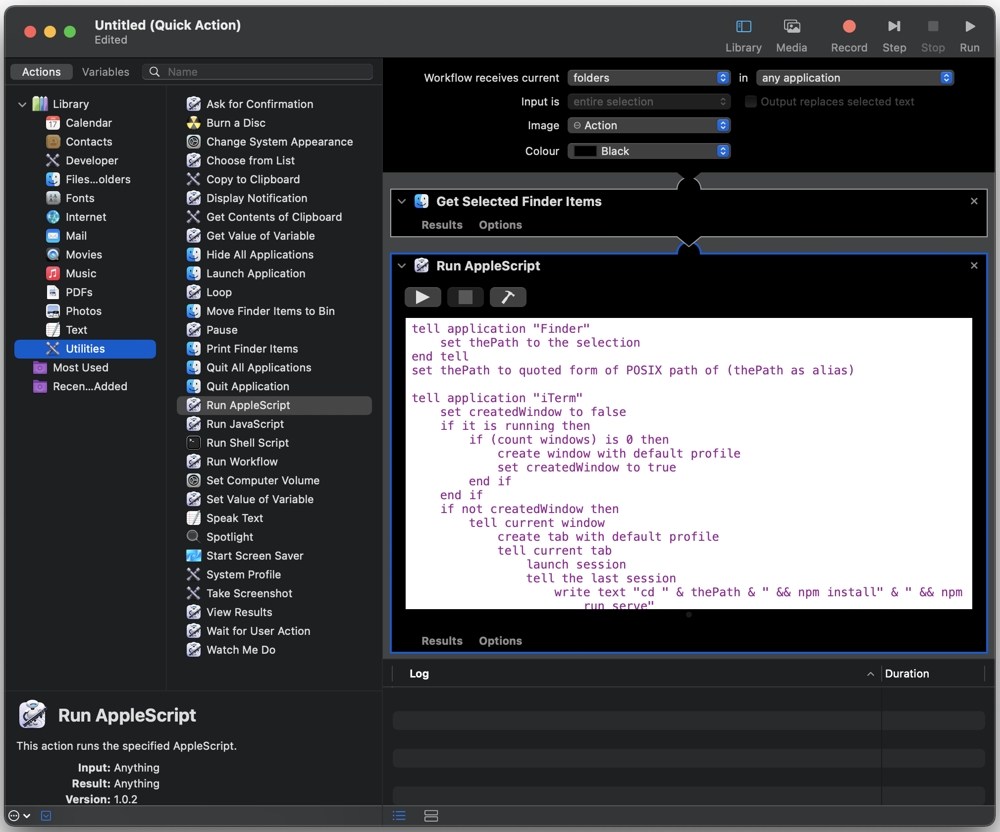
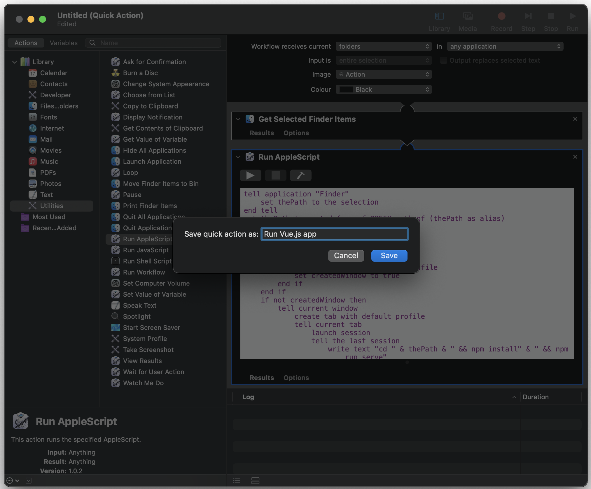
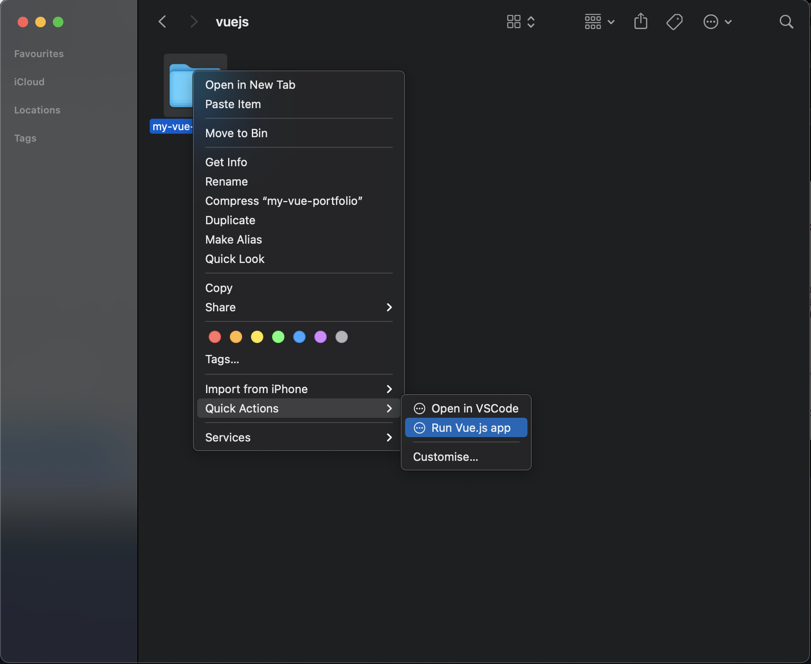
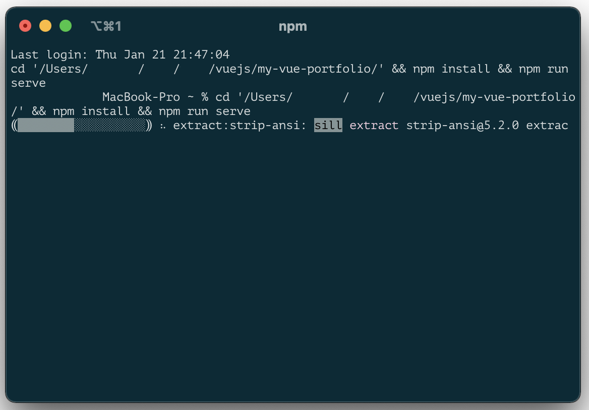

# Run Vue.js App Quick Action

With this Applescript you can run your Vue.js app from the Finder's context menu of your project's folder.
Script opens iTerm app (you can change it to terminal if you like it better) at the folder directory, installs all dependencies and runs it.

Setup
-----

## 1. Open the default app Automator on your Mac

You can do this by either:

* searching Automator  in the Spotlight  (CMD + Space) or
* opening it directly from ~/Applications/Automator.app.

## 2. Select Quick Action template

## 3. Get Selected Files/Folders from Finder

We need to figure out what folder is currently selected in Finder. We can achieve that using the "Get Selected Finder Items" action in our workflow:

* select "Files & Folders" group from the library
* find the  "Get Selected Finder Items" action
* drag and drop this action to the workflow
* change "Workflow recieves current ..." to "folders"

## 4. Open selected items in VSCode

The last step is to add our script. We can do this with "Run AppleScript" action:

* select "Utilities" group from the library
* find the  "Run AppleScript" action
* drag and drop this action to the workflow, below the "Get Selected Finder Items" action,
* copy code form [this file](../main/script.scpt) file and paste it in "Run AppleScript" textfield.

## 5. Save the action

Save (CMD + S) the action under clear and meaningful name like "Run Vue.js app". The name is important as it will be displayed in Finder!

## 6. Use it!

Once the action is saved, it should be automatically added to Finder's Services list. You can access it by right-clicking on a file or folder:

## 7. Enjoy the script's work in iTerm.

 
